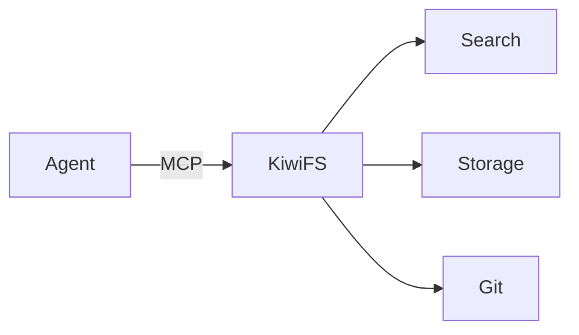

KiwiFS extends standard markdown with fenced code blocks that render as interactive widgets in the web UI. These blocks are portable — they degrade gracefully to plain code blocks in any markdown viewer.

## Block types

<CardGroup cols={2}>
  <Card title="Charts" icon="chart-bar">
    Bar, line, area, pie, radar, and scatter charts from YAML data.
  </Card>
  <Card title="DQL queries" icon="table">
    Inline tables and lists driven by DQL queries over frontmatter.
  </Card>
  <Card title="Kanban" icon="bars-progress">
    Inline kanban boards from YAML column definitions.
  </Card>
  <Card title="Playground" icon="sliders">
    Interactive widgets with sliders, toggles, selects, and color pickers.
  </Card>
  <Card title="App" icon="code">
    Sandboxed HTML/CSS/JS running in an iframe.
  </Card>
  <Card title="Diff" icon="code-compare">
    Annotated inline diffs with add/remove highlighting.
  </Card>
  <Card title="Progress" icon="battery-half">
    Progress bars and gauge indicators.
  </Card>
  <Card title="Color" icon="palette">
    Color palette swatches for design systems.
  </Card>
  <Card title="Mermaid" icon="diagram-project">
    Flowcharts, sequence diagrams, and other Mermaid diagrams.
  </Card>
  <Card title="Live widget" icon="bolt">
    React Live code blocks that render in the browser.
  </Card>
</CardGroup>

---

## kiwi-chart

Renders bar, line, area, pie, radar, or scatter charts from inline YAML data.

````markdown
```kiwi-chart
type: bar
title: Sprint velocity
data:
  - label: Sprint 1
    value: 21
  - label: Sprint 2
    value: 34
  - label: Sprint 3
    value: 28
```
````

Supported chart types: `bar`, `line`, `area`, `pie`, `radar`, `scatter`.

<AccordionGroup>
  <Accordion title="Multi-series charts">
    Use named series for grouped or stacked visualizations:

    ````markdown
    ```kiwi-chart
    type: bar
    title: Team output
    series:
      - name: Frontend
        data: [12, 19, 8]
      - name: Backend
        data: [15, 11, 22]
    labels: [Jan, Feb, Mar]
    ```
    ````
  </Accordion>
</AccordionGroup>

## kiwi-query

Renders a DQL query result as an inline table or list. The query runs against frontmatter metadata.

````markdown
```kiwi-query
TABLE title, status, priority
FROM "tasks"
WHERE status != "done"
SORT priority DESC
```
````

The result updates whenever the page is viewed. See [DQL](/concepts/dql) for the full query language.

## kiwi-kanban

Renders an inline kanban board from YAML column and card definitions.

````markdown
```kiwi-kanban
columns:
  - name: Todo
    cards:
      - title: Design API
        tags: [backend]
  - name: In Progress
    cards:
      - title: Build UI
        tags: [frontend]
  - name: Done
    cards:
      - title: Write tests
```
````

For workflow-driven kanban boards that read from file frontmatter, use the [Kanban toolbar view](/concepts/workflows) instead.

## kiwi-playground

Interactive widgets with controls that update in real time. Useful for documenting configurable parameters.

````markdown
```kiwi-playground
widgets:
  - type: slider
    label: Opacity
    min: 0
    max: 100
    value: 75
  - type: toggle
    label: Dark mode
    value: true
  - type: select
    label: Theme
    options: [kiwi, ocean, forest, sunset]
    value: kiwi
  - type: color
    label: Accent
    value: "#6cbe45"
  - type: number
    label: Font size
    min: 12
    max: 24
    value: 16
  - type: text
    label: Title
    value: "My page"
```
````

## kiwi-app

Runs sandboxed HTML, CSS, and JavaScript in an iframe.

````markdown
```kiwi-app
<style>
  .counter { font-size: 2em; text-align: center; padding: 2em; }
  button { font-size: 1.2em; padding: 0.5em 1em; }
</style>
<div class="counter">
  <p id="count">0</p>
  <button onclick="document.getElementById('count').textContent = ++window.n">+1</button>
</div>
<script>window.n = 0;</script>
```
````

<Warning>
The iframe is sandboxed. It cannot access the parent page, make network requests, or use cookies.
</Warning>

## kiwi-diff

Renders annotated inline diffs with syntax highlighting.

````markdown
```kiwi-diff
- const timeout = 5000;
+ const timeout = 30000;
  const retries = 3;
- const backoff = "linear";
+ const backoff = "exponential";
```
````

## kiwi-progress

Renders progress bars or gauge indicators.

````markdown
```kiwi-progress
type: bar
label: Migration progress
value: 73
max: 100
```
````

Supported types: `bar`, `gauge`.

## kiwi-color

Renders color palette swatches.

````markdown
```kiwi-color
colors:
  - name: Primary
    value: "#6cbe45"
  - name: Secondary
    value: "#4a8a2a"
  - name: Accent
    value: "#7dd356"
```
````

## Mermaid diagrams

Standard Mermaid fenced blocks render as diagrams.

````markdown

````

## Live widgets

### widget:live

React Live code blocks that compile and render in the browser.

````markdown
```widget:live
function Counter() {
  const [count, setCount] = React.useState(0);
  return <button onClick={() => setCount(c => c + 1)}>Count: {count}</button>;
}
```
````

### widget:code

Python code blocks that run via Pyodide in the browser.

````markdown
```widget:code
import math
print(f"Pi is approximately {math.pi:.4f}")
```
````

---

## Container directives

### Tabs

Wrap content in tab groups using `:::tabs` and `::tab[label]`:

```markdown
:::tabs

::tab[REST]
Use `PUT /api/kiwi/file` to create or update a page.

::tab[MCP]
Call `kiwi_write` with `path` and `content` arguments.

::tab[CLI]
Write the file directly: `echo "# Title" > page.md`

:::
```

### Columns

Split content into columns with `:::columns` and `:::col`:

```markdown
:::columns

:::col
Left column content here.
:::

:::col
Right column content here.
:::

:::
```

---

## Callouts

KiwiFS supports GitHub-style callouts and foldable variants:

```markdown
> [!NOTE]
> Standard informational callout.

> [!TIP]
> Helpful suggestion.

> [!WARNING]
> Potential issue to watch for.

> [!CAUTION]
> Dangerous action that could cause data loss.

> [!IMPORTANT]
> Critical information.
```

Add `-` or `+` to make callouts foldable:

```markdown
> [!NOTE]- Collapsed by default
> This content is hidden until expanded.

> [!TIP]+ Expanded by default
> This content is visible but can be collapsed.
```

---

## Related

<CardGroup cols={2}>
  <Card title="DQL" icon="database" href="/concepts/dql">
    Query language powering kiwi-query blocks.
  </Card>
  <Card title="Workflows" icon="bars-progress" href="/concepts/workflows">
    State machines behind Kanban boards.
  </Card>
  <Card title="Web UI" icon="window" href="/guides/web-ui">
    Full-screen views and editing features.
  </Card>
  <Card title="Canvas" icon="object-group" href="/concepts/canvas">
    Spatial diagrams in .canvas.json files.
  </Card>
</CardGroup>
